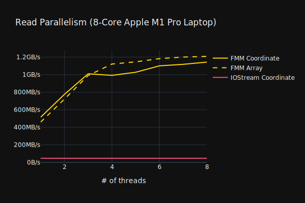
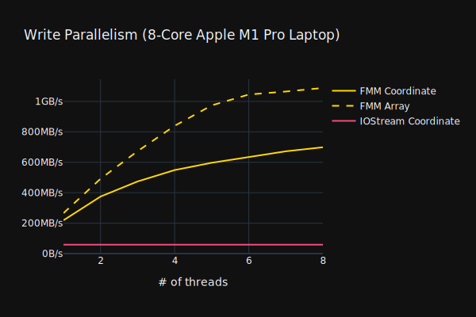

[](https://github.com/alugowski/fast_matrix_market/actions/workflows/tests.yml)
[](https://codecov.io/gh/alugowski/fast_matrix_market)
[](https://badge.fury.io/py/fast_matrix_market)

A fast and full-featured Matrix Market I/O library for C++ and [Python](python).

[Matrix Market](https://math.nist.gov/MatrixMarket/formats.html) is a simple, human-readable, and widely used sparse matrix file format that looks like this:
```
%%MatrixMarket matrix coordinate real general
% 3-by-3 identity matrix
3 3 3
1 1 1
2 2 1
3 3 1
```
Most sparse matrix libraries include Matrix Market read and write routines.

However, included routines are typically slow and/or are missing format features. Use this library to fix these shortcomings.

# Fast

`fast_matrix_market` takes the fastest available sequential methods and parallelizes them.

This lets us reach **>1GB/s** read and write speeds on a laptop (about 25x improvement over IOStreams).




Note: IOStreams benchmark is sequential because IOStreams get *slower* with additional parallelism due to internal locking on the locale.
Loaders using IOStreams or `fscanf` are both slow and do not parallelize. See [parse_bench](https://github.com/alugowski/parse-bench) for a demonstration.

The majority of `fast_matrix_market`'s improvement comes from using C++17's `std::from_chars` and `std::to_chars`.
If floating-point versions are not available then fall back on [fast_float](https://github.com/fastfloat/fast_float) 
and [Dragonbox](https://github.com/jk-jeon/dragonbox). These methods are then parallelized by chunking the input stream and parsing each chunk in parallel.

Use the `run_benchmarks.sh` script to see for yourself. The script builds, runs, and saves benchmark data, then simply run all the cells in the [benchmark_plots/plot.ipynb](benchmark_plots/plot.ipynb) Jupyter notebook.

# Full Featured

* `coordinate` and `array`, each readable into either sparse or dense structures.

* All `field` types supported: `integer`, `real`, `complex`, `pattern`.

  * Support all C++ types.
    * `float`, `double`, `long double`, `std::complex<>`, integer types, `bool`.
    * Arbitrary types. [Example using `std::string`](tests/user_type_test.cpp).

  * Automatic `std::complex` up-cast. For example, `real` files can be read into `std::complex<double>` arrays.

  * Read and write `pattern` files. Read just the indices or supply a default value.

* Both `matrix` and `vector` files. Most loaders crash on `vector` files.
  * A vector data structure (sparse doublet or dense) will accept either a `vector` file, an M-by-1 `matrix` file or a 1-by-N `matrix` file.
  * A matrix data structure will read a `vector` file as if it was a M-by-1 column matrix.

* Ability to read just the header (useful for metadata collection).

* Read and write Matrix Market header comments, including multiline comments.

* Read and write all symmetries: `general`, `symmetric`, `skew-symmetric`, `hermitian`.

* Optional (on by default) automatic symmetry generalization. If your code cannot make use of the symmetry but the file specifies one, the loader can emit the symmetric entries for you.

# Usage

`fast_matrix_market` provides both ready-to-use methods for common data structures and building blocks for your own. See [examples/](examples) for complete code.

## Coordinate / Triplets

```c++
struct triplet_matrix {
    int64_t nrows = 0, ncols = 0;
    std::vector<int64_t> rows, cols;
    std::vector<double> vals;
} mat;

fast_matrix_market::read_matrix_market_triplet(
                input_stream,
                mat.nrows, mat.ncols,
                mat.rows, mat.cols, mat.vals);
```

Doublet sparse vectors, composed of index and value vectors, are supported in a similar way by `read_matrix_market_doublet()`.

## Dense arrays

```c++
struct array_matrix {
    int64_t nrows = 0, ncols = 0;
    std::vector<double> vals;
} mat;

fast_matrix_market::read_matrix_market_array(
                input_stream,
                mat.nrows, mat.ncols,
                mat.vals,
                fast_matrix_market::row_major);
```

1D dense vectors supported by the same method.

## Eigen
Sparse and dense matrices and vectors are supported. See [Eigen README](README.Eigen.md).
```c++
Eigen::SparseMatrix<double> mat;
fast_matrix_market::read_matrix_market_eigen(input_stream, mat);
```

## SuiteSparse CXSparse
`cs_xx` structures (in both COO and CSC modes) are supported. See [CXSparse README](README.CXSparse.md).
```c++
cs_dl *A;
fast_matrix_market::read_matrix_market_cxsparse(input_stream, &A, cs_dl_spalloc);
```

## Blaze
[Blaze](https://bitbucket.org/blaze-lib/blaze) sparse and dense matrices and vectors are supported. See [Blaze README](README.Blaze.md).
```c++
blaze::CompressedMatrix<double> A;
fast_matrix_market::read_matrix_market_blaze(input_stream, A);
```

## Your Own

Simply provide `parse_handler` and `formatter` classes to read and write from/to any datastructure, respectively. The class you need is likely already in the library.

Follow the example of the triplet and array implementations in [include/fast_matrix_market/app/](include/fast_matrix_market/app).

# Installation

`fast_matrix_market` is a header-only library written in C++17. Parallelism uses C++11 threads.

### CMake

```cmake
include(FetchContent)
FetchContent_Declare(
        fast_matrix_market
        GIT_REPOSITORY https://github.com/alugowski/fast_matrix_market
        GIT_TAG main
        GIT_SHALLOW TRUE
)
FetchContent_MakeAvailable(fast_matrix_market)

target_link_libraries(YOUR_TARGET fast_matrix_market::fast_matrix_market)
```

Alternatively copy or checkout the repo into your project and:
```cmake
add_subdirectory(fast_matrix_market)
```
See [examples/](examples) for what parts of the repo are needed.

### Manual Copy
You may also copy `include/fast_matrix_market` into your project's `include` directory.

Define:
* `FMM_FROM_CHARS_<INT|DOUBLE|LONG_DOUBLE>_SUPPORTED` as appropriate for your compiler.
* `FMM_TO_CHARS_<INT|DOUBLE|LONG_DOUBLE>_SUPPORTED` as appropriate for your compiler.

For best performance also include:
* [fast_float](https://github.com/fastfloat/fast_float) and define `FMM_USE_FAST_FLOAT`.
* [Dragonbox](https://github.com/jk-jeon/dragonbox) and define `FMM_USE_DRAGONBOX`.


# 3rd Party Libraries Used
These are automatically fetched if using CMake.

* [fast_float](https://github.com/fastfloat/fast_float) for floating-point parsing (Optional).
* [Dragonbox](https://github.com/jk-jeon/dragonbox) for floating-point rendering (Optional).
* [thread-pool](https://github.com/bshoshany/thread-pool) for a lightweight thread pool using C++11 threads (Bundled). 

Standard library fallbacks for the above libraries are included, but both sequential and parallel performance can suffer without them.