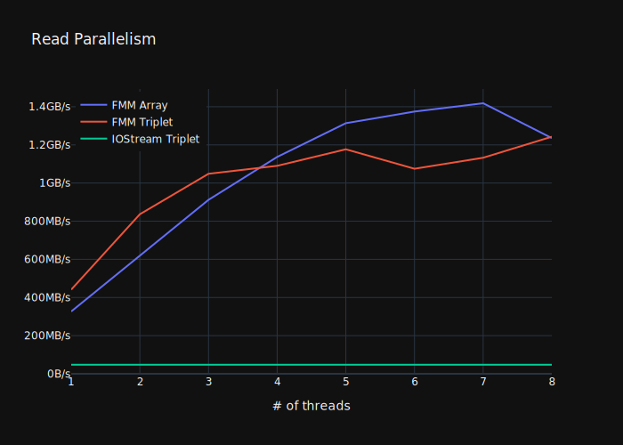
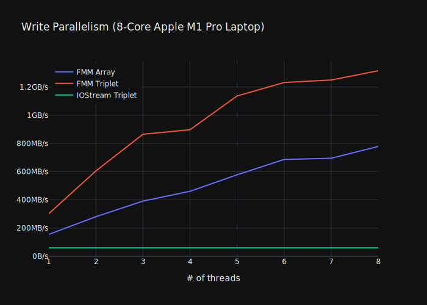

A fast and full-featured Matrix Market I/O library.

[Matrix Market](https://math.nist.gov/MatrixMarket/formats.html) is a simple, human-readable, and widely used sparse matrix file format that looks like this:
```
%%MatrixMarket matrix coordinate real general
% 3-by-3 identity matrix
3 3 3
1 1 1
2 2 1
3 3 1
```
Most sparse matrix libraries include Matrix Market read and write routines.

However, included routines are typically slow and/or are missing format features. Use this library to fix these shortcomings.

## Fast

`fast_matrix_market` takes the fastest available sequential methods for a 10x sequential speed improvement over `iostreams`.

The majority of the improvement comes from using C++17's `std::from_chars` and `std::to_chars`.
Also:
* Parse floating-point using [`fast_float`](https://github.com/fastfloat/fast_float). Compiler support for floating-point `std::from_chars` varies.
* Write floating-point using [`Dragonbox`](https://github.com/jk-jeon/dragonbox). Compiler support for floating-point `std::to_chars` varies.

We include standard library fallbacks for the above libraries, but both sequential and parallel performance suffers without them.

Loaders using `iostreams` or `fscanf` are both slow and do not parallelize. See [parse_bench](https://github.com/alugowski/parse-bench) for a demonstration.

## Parallel

We support parallel reading and writing using C++11 threads.

This lets us reach **>1GB/s** read and write speeds on a laptop (about 25x improvement over `iostreams`).




Note: IOStreams benchmark is sequential. IOstreams get *slower* with additional parallelism due to internal locking on the locale.

Run the benchmarks on your own machine, they're fully automated and intended to be run. The `run_benchmarks.sh` script builds, runs, and saves benchmark data, then simply run all the cells in the [benchmark_plots/plot.ipynb](benchmark_plots/plot.ipynb) Jupyter notebook.

## Full Featured

* `matrix` and `vector` files.
  * A vector data structure (sparse doublet or dense) will accept either a `vector` file, an M-by-1 `matrix` file or a 1-by-N `matrix` file.

* `coordinate` and `array`, each readable into either sparse or dense structures.

* All `field` types supported, with appropriate C++ types: `integer`, `real`, `double`, `complex`, `pattern`.

  * Support all C++ integer types, `float`, `double`, `long double`, `std::complex<>`.

  * Automatic `std::complex` up-cast. For example, `real` files can be read into `std::complex<double>` arrays.

  * Read and write `pattern` files. Read just the indices or supply a default value.

* Ability to read just the header (useful for metadata collection).

* Read and write Matrix Market header comments, including multiline comments.

* Read and write all symmetries.

* Optional (on by default) automatic symmetry generalization if your code cannot make use of the symmetry but the file specifies one. 
Matrix Market format spec says that for any symmetries other than general, "only entries in the lower triangular portion need be supplied."
  * **`symmetric`:** for `(row, column, value)`, also emit `(column, row, value)`
  * **`skew-symmetric`:** for `(row, column, value)`, also emit `(column, row, -value)`
  * **`hermitian`:** for `(row, column, value)`, also emit `(column, row, complex_conjugate(value))`


## Installation

`fast_matrix_market` is a header-only library written in C++17.

#### CMake Fetch
Use CMake to fetch the library

```cmake
include(FetchContent)
FetchContent_Declare(
        fast_matrix_market
        GIT_REPOSITORY https://github.com/alugowski/fast_matrix_market
        GIT_TAG main
        GIT_SHALLOW TRUE
)
FetchContent_MakeAvailable(fast_matrix_market)

target_link_libraries(YOUR_TARGET fast_matrix_market::fast_matrix_market)
```

#### CMake Subdirectory
You may copy or checkout the repo into your project and use `add_subdirectory`:
```cmake
add_subdirectory(fast_matrix_market)

target_link_libraries(YOUR_TARGET fast_matrix_market::fast_matrix_market)
```

#### Copy
You may also copy `include/fast_matrix_market` into your project's `include` directory.

Be sure to also include:
 * [`fast_float`](https://github.com/fastfloat/fast_float) library. You can omit it if you know your compiler implements `std::from_chars<double>` (e.g. VisualStudio, GCC 12+).
 * [`Dragonbox`](https://github.com/jk-jeon/dragonbox) Also omittable if your compiler implements `std::to_chars<double>` or if performance and parallelism are not important.


## Easy Integration

Easy reading/writing against any datastructure.

Simply provide short `parse_handler` to read into any datastructure, and `formatter` classes to write from any datastructure.

Bundled integrations include:
* `std::vector`-based triplet sparse matrices, also known as coordinate (COO) matrices. A vector each for row indices, column indices, values.
* Dense arrays, both 1D and 2D
* **Eigen** `SparseMatrix` matrices and dense `Matrix`/`Vector`. See [Eigen README](README.Eigen.md).
* **SuiteSparse [CXSparse](https://github.com/DrTimothyAldenDavis/SuiteSparse/tree/dev/CXSparse)** `cs_xx` structures, in both COO and CSC modes. See [CXSparse README](README.CXSparse.md).


## Other 3rd Party Libraries Used
Bundled thread pool implementation from [thread-pool](https://github.com/bshoshany/thread-pool). Thank you!