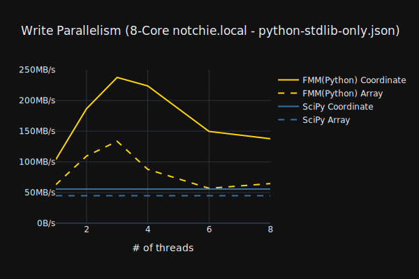
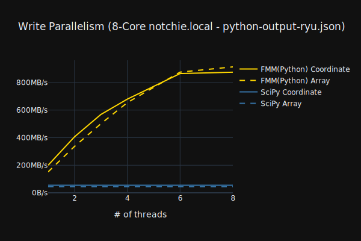

# Dependencies

These optional dependencies speed up floating-point parsing and formatting.
Standard library fallbacks are included but both sequential and parallel performance suffer without them.

## [fast_float](https://github.com/fastfloat/fast_float)
Floating-point parsing.

Using the header-only single file release version. To upgrade just paste in a new version of `fast_float.h`.

Optional, set `FMM_USE_FAST_FLOAT=OFF` to disable.

## [Dragonbox](https://github.com/jk-jeon/dragonbox)
Floating-point rendering for shortest representation only.

Using a pruned copy of the dragonbox repo. The full release includes two large PDFs, subprojects, etc.
Just clone the repo and delete anything not needed to build the library.

Optional, set `FMM_USE_DRAGONBOX=OFF` to disable.

## [Ryu](https://github.com/ulfjack/ryu)
Floating-point rendering supports both shortest representation and user-specified precision.

Optional, set `FMM_USE_RYU=OFF` to disable.

## [task-thread-pool](https://github.com/alugowski/task-thread-pool)
A lightweight thread pool using C++11 threads. Vendored in `include/`.

# Why not just use the standard library?

Apart from `std::from_chars` and `std::to_chars`, all standard library number parse and format routines have an internal dependency on the system locale.
In practice this means they all internally lock on the same lock, effectively eliminating parallel performance.

Here is an example. This is the [FMM Python bindings](../python) built against only standard library routines:

Note the sharp drop in performance with 4 or more threads, and at 6 threads performance is nearly equal to single threaded.

Note also that the sequential (p=1) performance is also slow, but this will improve over time as fast_float and Ryu are incorporated into compilers.

Contrast that against the same benchmark with Ryu:

Ryu enables performance to scale linearly with number of cores.

The flatness of the curve at 7 and 8 cores is because the machine has 6 performance and 2 efficiency cores (Apple M1 Pro).