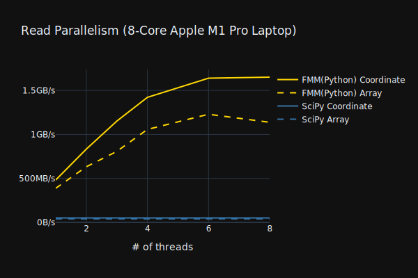
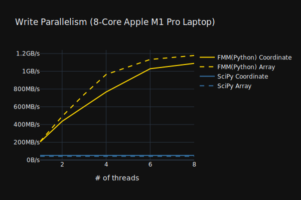

Fast and full-featured Matrix Market file I/O

Python bindings for the C++ `fast_matrix_market` Matrix Market I/O library.

```python
import fast_matrix_market as fmm
```




## Matrix Market Header
```python
header = fmm.read_header("eye3.mtx")
>>> header(shape=(3, 3), nnz=3, comment="3-by-3 identity matrix", object="matrix", format="coordinate", field="real", symmetry="general")
header.shape
>>> (3, 3)
header.to_dict()
>>> {'shape': (3, 3), 'nnz': 3, 'comment': '3-by-3 identity matrix', 'object': 'matrix', 'format': 'coordinate', 'field': 'real', 'symmetry': 'general'}
```

## Compatibility with SciPy

As of SciPy version 1.10.0:
* `scipy.io.mmread` throws a `ValueError` on `object=vector` files.
* On most machines SciPy can only handle 32-bit row/column indices.
* By default `mmwrite()` searches for any symmetries in the matrix. This can be very slow, though can be disabled with `symmetry="general"`
* `mmwrite()` converts to `coo_matrix` first. `fast_matrix_market` can write directly from CSC/CSR without conversion.
* Defined size types. 
* Load complex96

# Dependencies

* None to read/write MatrixMarket headers 
* `numpy` to read/write arrays (i.e. `read_array()` and `read_tuple()`) 
* `scipy` to read/write `scipy.sparse` sparse matrices (i.e. `read_scipy()` and `mmread()`)
